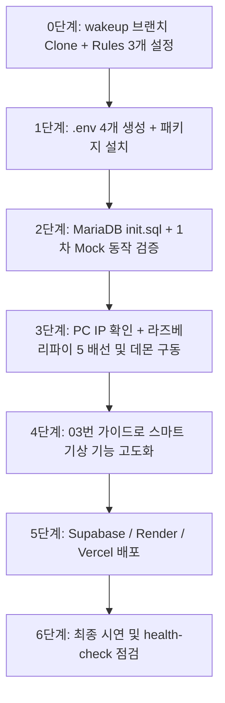

# 학생 수작업 로드맵 (체크리스트)

> 📂 **본편 02 / 팀 전원 / 2차 개발 실천 체크용** · 상세 설명은 [01-학생용-설치-및-사용-매뉴얼](01-학생용-설치-및-사용-매뉴얼.md) · 전체 목록 [docs/README.md](README.md)

> AI에게 프롬프트로 시키지 않고 **학생이 직접 터미널/GUI/브라우저로 실행해야 하는 수작업 체크리스트**입니다.
> 1차 완성본(`wakeup` 브랜치)을 바탕으로 환경을 띄우고, 라즈베리파이 5 실기기를 연결하며 기능을 고도화할 때 진행 상황을 점검하는 용도로 사용합니다.



---

## 0단계. 저장소 받기 + 워크스페이스 준비 (팀당 1회)

- [ ] `git clone -b wakeup https://github.com/foxjini/agent-vibe-coding-starter-kit2.git iot-vision-control-system`
- [ ] Antigravity IDE에서 `iot-vision-control-system` 폴더 열기
- [ ] Customizations → Rules에서 **딱 3개만 Always On** 확인:
  - `karpathy-principles`
  - `security-rules`
  - `coding-standards`
  *(나머지 7개 규칙은 필요 시 각 Agent가 자동 참조하므로 꺼둠 — 토큰 절약)*
- [ ] 1차 완성 파일 확인 (`backend/`, `frontend/`, `vision/yolov8n.onnx`, `pi/main.py`, `run_system.ps1`)

---

## 1단계. 환경변수(.env) 설정 및 패키지 설치

- [ ] `.env.example` → `.env` 4개 파일 복사:
  ```powershell
  copy backend\.env.example backend\.env
  copy frontend\.env.example frontend\.env
  copy vision\.env.example vision\.env
  copy pi\.env.example pi\.env
  ```
- [ ] `backend/.env`, `vision/.env`, `pi/.env`의 `DEVICE_API_KEY`가 동일한지 확인 (기본값: `dev_secret_key_1234`)
- [ ] **백엔드 venv & 패키지 설치**:
  ```powershell
  cd backend; python -m venv venv; .\venv\Scripts\Activate.ps1; pip install -r requirements.txt; cd ..
  ```
- [ ] **프론트엔드 패키지 설치**:
  ```powershell
  cd frontend; npm install; cd ..
  ```
- [ ] **비전 초경량 ONNX 가상환경 설치**:
  ```powershell
  cd vision; py -3.12 -m venv venv; .\venv\Scripts\Activate.ps1; pip install -r requirements.txt; cd ..
  ```

---

## 2단계. 로컬 DB 설정 및 1차 시스템 베이스라인 동작 검증

- [ ] XAMPP Control Panel에서 **MySQL(MariaDB) Start**
- [ ] MariaDB 초기화 스크립트 실행 (PowerShell):
  ```powershell
  cd backend
  Get-Content db\init.sql | mysql -u root
  cd ..
  ```
  *(또는 phpMyAdmin 웹 SQL 탭에서 `backend/db/init.sql` 내용 실행)*
- [ ] 시스템 실행 (아래 중 택1):
  - **옵션 A (간편 자동)**: `.\run_system.ps1` 실행
  - **옵션 B (멀티 터미널 개별)**:
    - [터미널 1 - 백엔드]: `cd backend; .\venv\Scripts\Activate.ps1; uvicorn main:app --reload --host 0.0.0.0 --port 8000`
    - [터미널 2 - 프론트]: `cd frontend; npm run dev`
    - [터미널 3 - 비전]: `cd vision; .\venv\Scripts\Activate.ps1; python main.py`
    - [터미널 4 - Mock 하드웨어]: `cd pi; python main.py`
- [ ] **1차 동작 시나리오 검증**:
  - [ ] `http://localhost:3000` 대시보드 접속 → 상단 "● 실시간 연결됨" 확인
  - [ ] "5초 후 테스트" 알람 예약 → 피에조 부저 Mock(PC 사운드 비프음) 발생 확인
  - [ ] 웹캠 앞 인물 감지 시 알람 자동 정지 확인
  - [ ] 알람 해제 25초 후 "2차 수면 방지 기상 확인" 팝업 발생 확인
  - [ ] 팝업의 "기상 확인" 버튼 클릭 시 최종 기상 완료 확인
- [ ] 소스 제어 GUI(Ctrl+Shift+G)로 초기 환경 점검 커밋

---

## 3단계. 2차 개발 ① — 라즈베리파이 5 실기기 연동

- [ ] *(임시 테스트 시스템으로 연습한 팀만)* [`docs/부록B-iot-test-system-연동-가이드.md`](부록B-iot-test-system-연동-가이드.md) 확인
- [ ] [`docs/부록A-백엔드-라즈베리파이5-연동-인터페이스-가이드.md`](부록A-백엔드-라즈베리파이5-연동-인터페이스-가이드.md)의 REST 계약 확인
- [ ] Windows PC의 IP 주소 확인 (`ipconfig` 실행 → IPv4 주소 확인)
- [ ] 라즈베리파이 터미널에서 패키지 설치:
  ```bash
  cd pi; python3 -m venv venv; source venv/bin/activate
  pip install gpiozero lgpio requests python-dotenv
  ```
- [ ] `pi/.env`의 `BACKEND_URL`에 PC IP 입력 (예: `http://192.168.0.25:8000`), `DEVICE_MODE=hardware` 설정
- [ ] Windows PC `backend/.env`의 `DEVICE_MODE=hardware`로 변경 후 백엔드 재시작 (`--host 0.0.0.0` 필수, 방화벽 8000번 포트 인바운드 허용 확인)
- [ ] **전원을 끈 상태**에서 피에조 부저(GPIO 18 권장) 및 버튼(GPIO 24 권장) 배선
- [ ] 교사 입회 하에 전원 인가 후 라즈베리파이에서 데몬 실행:
  ```bash
  python main.py
  ```
- [ ] 대시보드에서 알람 울림 시 실제 라즈베리파이 피에조 부저 작동 확인
- [ ] 소스 제어 GUI로 하드웨어 연동 커밋

---

## 4단계. 2차 개발 ② — 스마트 기상 시스템 기능 고도화

- [ ] [`docs/03-2차개발-생성형AI-핸드오버-가이드.md`](03-2차개발-생성형AI-핸드오버-가이드.md) 1장 시스템 프롬프트를 AI에게 전달
- [ ] **기상 미션 고도화**:
  - 가위바위보 손동작 인식 (MediaPipe 제스처 인식)
  - 지정 사물(물병, 책 등 COCO 80종) 비전 인식
- [ ] **2차 수면 방지 로직 강화**:
  - 15초 제한 시간 타임아웃 시 더 강력한 2차 재알람 발동
  - 라즈베리파이 물리 버튼/터치패드를 눌러야만 팝업 확인 완료
- [ ] **대시보드 UI/UX 확장**:
  - 요일별/반복 알람 설정 기능
  - 기상 통계 및 시연용 로그 시각화
- [ ] 소스 제어 GUI로 2차 기능 고도화 커밋

---

## 5단계. 클라우드 배포 (Supabase, Render, Vercel)

- [ ] Supabase 프로젝트 생성 및 PostgreSQL 마이그레이션 SQL 실행 (`.agents/skills/db-migration/SKILL.md` 참고)
- [ ] Render에서 FastAPI 백엔드 Web Service 배포 및 환경변수 등록
- [ ] Vercel에서 Next.js 프론트엔드 배포 및 `NEXT_PUBLIC_API_BASE_URL` 등록
- [ ] 외부 웹 URL 및 실기기 연동 최종 엔드투엔드 시연 확인

---

## 6단계. 정기 점검 및 디버깅 (상시)

- [ ] 기능 추가 시 `.agents/workflows/health-check.md` 워크플로우로 전체 시스템 점검
- [ ] 오류 발생 시 로그만 복사해 `.agents/workflows/bugfix.md` 프롬프트로 외과적 수정 요청 (전체 재작성 금지)
