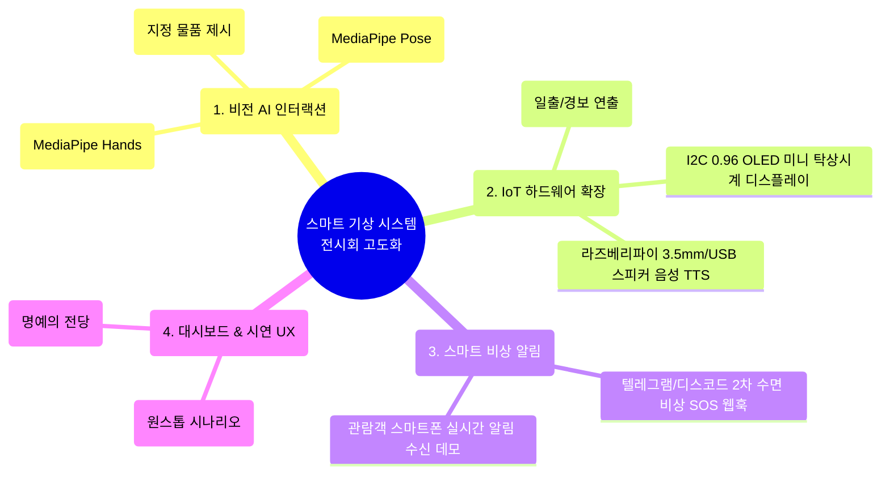
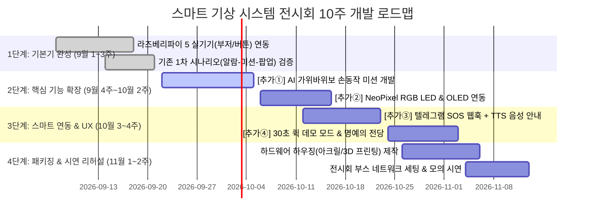

# 작품 전시회 대비 스마트 기상 시스템 기능 확장 아이디어 및 로드맵

> 📂 **본편 04 / 팀 전원 / 11월 중순 전시회 대비** · 전체 목록 [docs/README.md](README.md)
> 
> **목적**: 11월 중순에 예정된 작품 전시회(졸업작품/성과발표회/프로젝트 박람회)에서 관람객의 흥미와 참여를 유도하고, 시스템의 완성도와 기술적 깊이(하드웨어·AI·웹·클라우드)를 극대화하기 위한 **추가 기능 아이디어와 10주간의 단계별 개발 로드맵**을 정의합니다.

---

## 1. 전시회 관점에서 본 현재 시스템 분석

현재 스마트 기상 시스템은 [FastAPI 백엔드](../backend/main.py) + [Next.js 웹 대시보드](../frontend/app/page.tsx) + [YOLO 초경량 비전](../vision/main.py) + [라즈베리파이 5 Mock/실기기](../pi/main.py)의 기본 파이프라인(알람 발동 → 비전 미션 해제 → 2차 수면 방지 팝업)을 안정적으로 갖추고 있습니다.

하지만 **전시회 부스 환경(관람객 1인당 체류 시간 1~3분 내외)**을 고려하면 다음과 같은 개선점이 필요합니다:

| 분석 항목 | 현재 1차 상태 | 전시회 시연 시 문제점 | 개선 필요 방향 |
|---|---|---|---|
| **시청각 피에조 부저** | 단조로운 "삑- 삑-" 단음 비프 | 주변 소음이 심한 전시장 부스에서 눈에 띄지 않음 | 화려한 **RGB LED 조명(일출/경보 효과)** 및 **TTS 음성 안내** 도입 |
| **비전 인터랙션** | 웹캠 앞 사람/물병 단순 정적 감지 | 10초 만에 끝나 관람객이 시스템의 동작 원리를 체감하기 어려움 | 관람객이 직접 참여하는 **AI 가위바위보 배틀 / 스트레칭 모션** |
| **디바이스 형태** | PC 화면 중심의 조작 | 하드웨어 작품이라는 느낌이 약함 | 라즈베리파이 본체에 **미니 OLED 탁상시계 UI** 및 깔끔한 케이싱 |
| **시연 편의성** | 실제 시각 설정 또는 수동 타이머 | 관람객 회전율이 떨어지고 단계별 시연 과정이 늘어짐 | 원클릭 **전시회 전용 30초 퀵 시연 모드** 추가 |
| **외부 연동성** | 화면 내 팝업 확인에 국한 | 현실 스마트 IoT의 효용성 어필 부족 | 2차 수면 실패 시 **스마트폰(텔레그램/카카오톡) 비상 SOS 알림** 전송 |

---

## 2. 전시회 부스 흥행을 위한 4대 추가 기능 아이디어

### ① [비전 AI] 관람객 참여형 "AI 가위바위보 배틀 & 스트레칭 미션"
*전시회에서 관람객의 발길을 멈추게 하는 가장 확실한 장치는 '체험형 게임'입니다.*

- **시나리오**:
  1. 알람이 울리면 웹 대시보드 화면에 AI가 무작위로 패("가위", "바위", "보")를 냅니다.
  2. 관람객이 카메라 앞에서 **AI를 이기는 손동작**을 3초 내에 제시해야 알람 카운트가 차감됩니다 (예: 2~3회 연속 승리 시 알람 종료).
  3. 옵션 미션으로 **"두 팔을 번쩍 드는 기상 스트레칭(만세 동작)"**을 인식하여 온몸으로 잠을 깨우는 퍼포먼스를 유도합니다.
- **기술 스택**: `mediapipe` (Hands / Pose) 기반 초경량 랜드마크 분석 모듈을 `vision/`에 추가.
- **기대 효과**: 관람객이 직접 손을 움직이며 참여하므로 부스에 인파가 모이고 체험 만족도가 극대화됩니다.

---

### ② [IoT 하드웨어] 일출 시뮬레이션 "NeoPixel RGB LED 조명 & 미니 OLED 탁상시계"
*시각적인 화려함과 완성도 높은 임베디드 완성품 형태를 제공합니다.*

- **시나리오**:
  - **스마트 기상 조명 (WS2812B NeoPixel 8구 링/스트립)**:
    - 알람 30초 전: 은은한 새벽 주황색 → 일출 백색으로 서서히 밝아짐 (Sunrise Effect).
    - 알람 발동 중: 강렬한 레드 스트로브 깜빡임 (비상 경보).
    - 미션 완수 시: 청량한 에메랄드 그린/스카이블루 그라데이션 점등.
  - **라즈베리파이 I2C 0.96인치 OLED (SSD1306)**:
    - 침대 머리맡 탁상시계처럼 라즈베리파이 본체 화면에 `[07:00 / AM]`, `[미션: 바위를 내세요!]`, `[2차 수면 방지 카운트다운 15s]` 실시간 렌더링.
- **기술 스택**: 라즈베리파이 5 `rpi_ws281x` (또는 SPI 제어) + `Adafruit-SSD1306` (I2C 통신).
- **기대 효과**: 전시장 조명 아래에서도 화려한 빛의 변화가 멀리서 보이며, 독립된 스마트 기기로서의 시제품 완성도가 부각됩니다.

---

### ③ [스마트 서비스] "텔레그램/디스코드 2차 수면 비상 SOS 웹훅" & 음성 TTS
*단순 모니터 알람을 넘어 실생활과 연결되는 스마트 IoT의 가치를 입증합니다.*

- **시나리오**:
  1. 미션 성공 후 2차 수면 방지 확인 시간(전시회 데모: 10초) 내에 터치 버튼을 누르지 않으면 백엔드가 즉시 2차 수면으로 판정합니다.
  2. 재알람 발동과 동시에 지정된 **텔레그램 채널/디스코드 웹훅**으로 비상 메시지 전송:
     > 🚨 **[기상 경보] 김학생 님이 알람 해제 후 2차 수면에 빠졌습니다! 즉시 전화로 깨워주세요!**
  3. 라즈베리파이 스피커에서 친근한 음성(TTS)으로 알람 멘트 송출:
     > *"일어날 시간입니다! 화면을 보고 가위바위보 미션을 수행하세요."*
- **기술 스택**: 백엔드 `httpx` 비동기 웹훅 호출, `edge-tts` 기반 음성 mp3 실시간 합성 및 재생.
- **기대 효과**: 시연 중 관람객 본인의 텔레그램이나 팀 스마트폰에 즉각 알림이 울리는 모습을 시연하여 평가위원들의 실용성 점수를 확보합니다.

---

### ④ [대시보드 UX] "전시회 전용 30초 원클릭 퀵 시연 모드" & "기상 챔피언 순위표"
*전시회 현장의 원활한 운영과 관람객 기록 경쟁(게이미피케이션)을 지원합니다.*

- **시나리오**:
  - **원클릭 퀵 데모 버튼 (`[전시회 30초 체험 시작]`)**:
    - 복잡한 알람 시간 예약 없이, 버튼 클릭 즉시 [5초 대기 → 알람 울림 및 LED 점등 → 손동작 미션 → 10초 2차 수면 카운트다운 → 완료] 사이클이 자동으로 흘러갑니다.
  - **기상 챔피언 명예의 전당 (Top 5)**:
    - 알람 시작부터 미션 성공 및 터치 확인까지 걸린 반응 시간(초)을 측정하여 당일 최고 반응속도 순위표를 대시보드 우측에 표시.
- **기술 스택**: Next.js 대시보드 컴포넌트 추가 및 MariaDB `records` 테이블 로깅.
- **기대 효과**: 관람객 회전율이 1분 이내로 빨라지며, 친구들끼리 "누가 더 빨리 끄나" 기록 경쟁을 유도하여 재미를 극대화합니다.

---

## 3. 11월 중순 전시회를 위한 10주 단계별 개발 로드맵

현재 시점(9월 초)부터 11월 중순까지 **총 10주간의 마일스톤**입니다.

### 주차별 상세 작업 내역

| 주차 | 개발 단계 | 주요 목표 및 작업 내용 | 산출물 |
|---|---|---|---|
| **1~2주차** (9/7 ~ 9/20) | **1차 안정화 & HW 기초** | • 라즈베리파이 5에 부저(GPIO 18), 버튼(GPIO 24) 배선 및 `pi/main.py` 실기기 전환 • 백엔드-비전-라즈베리파이 통신 지연시간 최소화 검증 | 부저/버튼 실기기 동작 완료 |
| **3~4주차** (9/21 ~ 10/4) | **비전 미션 고도화** | • MediaPipe 기반 실시간 가위바위보 손동작 인식 모듈 추가 • 백엔드 기상 챌린지 룰 엔진 연동 (랜덤 퀴즈 출제 및 정답 검증) | 가위바위보 기상 미션 |
| **5~6주차** (10/5 ~ 10/18) | **하드웨어 인터랙션** | • WS2812B NeoPixel RGB LED(일출/경보 점등 효과) GPIO 연동 • I2C 0.96 OLED 화면에 미니 시계 및 실시간 미션 가이드 출력 | 화려한 하드웨어 조명/디스플레이 |
| **7~8주차** (10/19 ~ 11/1) | **스마트 연동 & 데모 UX** | • 2차 수면 시 텔레그램/디스코드 SOS 실시간 웹훅 발송 • 대시보드 `전시회 30초 퀵 데모 모드` 및 반응속도 랭킹 UI 구현 | 스마트 알림 및 원클릭 데모 |
| **9~10주차** (11/2 ~ 11/15) | **외관 패키징 & 최종 리허설** | • 라즈베리파이 + 센서 + 디스플레이 아크릴/3D 프린팅 케이스 결합 • 전시장 인터넷 환경 대비(로컬 AP 핫스팟 모드 준비) 및 예외 방어 리허설 | 최종 전시 작품 및 시연 대본 |

---

## 4. 추천 하드웨어 부품 및 핀 배치 계획

마이스터고 실습실에서 쉽게 구할 수 있는 표준 부품을 기준으로 구성합니다:

| 부품명 | 규격 및 권장 모델 | 라즈베리파이 5 연결 핀 | 용도 |
|---|---|---|---|
| **피에조 부저** | 5V 능동형(Active) 부저 | GPIO 18 (PWM / Pin 12) | 기존 알람 경보음 출력 |
| **터치 센서/버튼** | TTP223 정전식 터치 모듈 or 푸시 버튼 | GPIO 24 (Pin 18) | 2차 수면 방지 확인 입력 |
| **NeoPixel RGB LED** | WS2812B 8구 링 또는 8구 바 (5V) | GPIO 12 (Pin 32) + 5V/GND | 일출 조명 및 비상 스트로브 점등 |
| **OLED 디스플레이** | 0.96인치 I2C OLED (SSD1306) | SDA(GPIO 2), SCL(GPIO 3) | 탁상시계 및 미션 안내 텍스트 |
| **미니 스피커** | 3.5mm AUX 또는 USB 스피커 | 라즈베리파이/PC 사운드 출력 | TTS 음성 멘트 및 풍부한 알람음 |

---

## 5. 팀원별 추천 역할 분담표 (3~4인 기준)

| 역할 | 담당자 | 주력 개발 파일 및 업무 |
|---|---|---|
| **하드웨어 (라즈베리파이)** | 팀원 A | • [pi/main.py](../pi/main.py) GPIO 제어 (부저, 터치버튼, NeoPixel LED, OLED) • 하드웨어 회로 배선 및 전시용 외관 케이스(하우징) 제작 |
| **비전 AI (컴퓨터비전)** | 팀원 B | • [vision/main.py](../vision/main.py) MediaPipe 가위바위보 손동작/스트레칭 판별 • 웹캠 영상 위에 한글 가이드 오버레이 및 챌린지 성공률 튜닝 |
| **백엔드 & 시스템 통합** | 팀원 C | • [backend/services/trigger_service.py](../backend/services/trigger_service.py) 챌린지 엔진 및 2차 수면 로직 • 텔레그램 SOS 웹훅 연동 및 WebSocket 브로드캐스트 최적화 |
| **프론트엔드 & UX** | 팀원 D | • [frontend/app/page.tsx](../frontend/app/page.tsx) 전시회 30초 퀵 시연 모드 버튼 • 인터랙티브 기상 챌린지 모달 및 관람객 반응속도 순위표(랭킹) UI |

---

## 6. 다음 추천 단계

1. **팀 회의 진행**: 위 4대 추가 기능 중 **가장 시연 효과가 크다고 판단되는 기능 1~2개**를 1차 우선순위로 선정합니다.
2. **2차 착수**: 선정된 기능을 바탕으로 [docs/03-2차개발-생성형AI-핸드오버-가이드.md](03-2차개발-생성형AI-핸드오버-가이드.md)를 참고하여 AI 어시스턴트에게 단계별 구현을 요청합니다.
